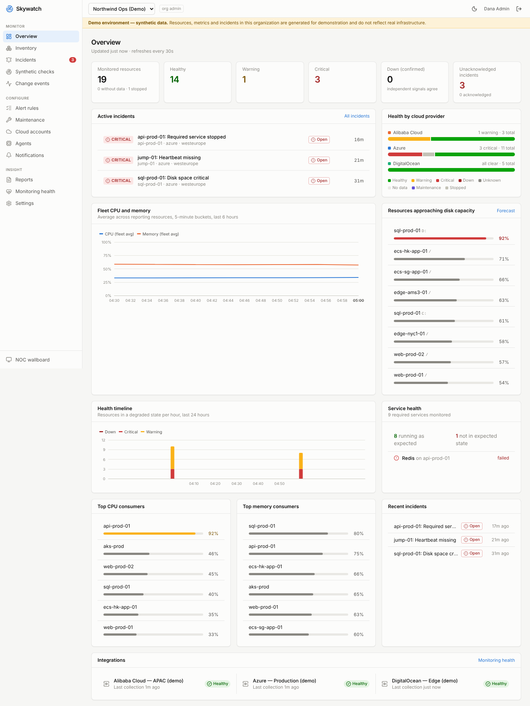
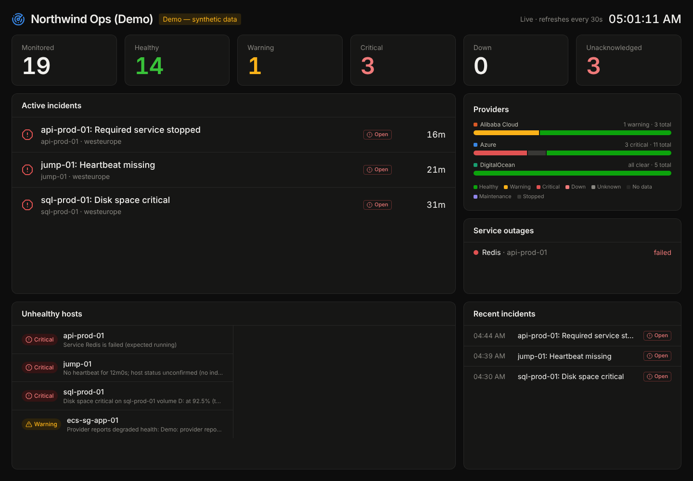
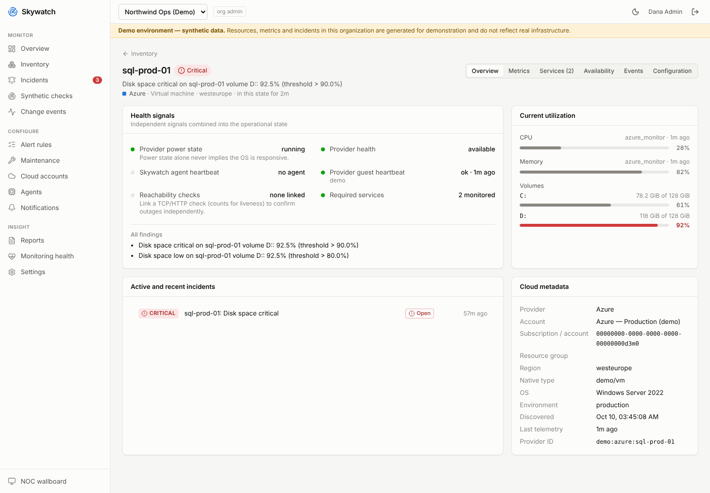
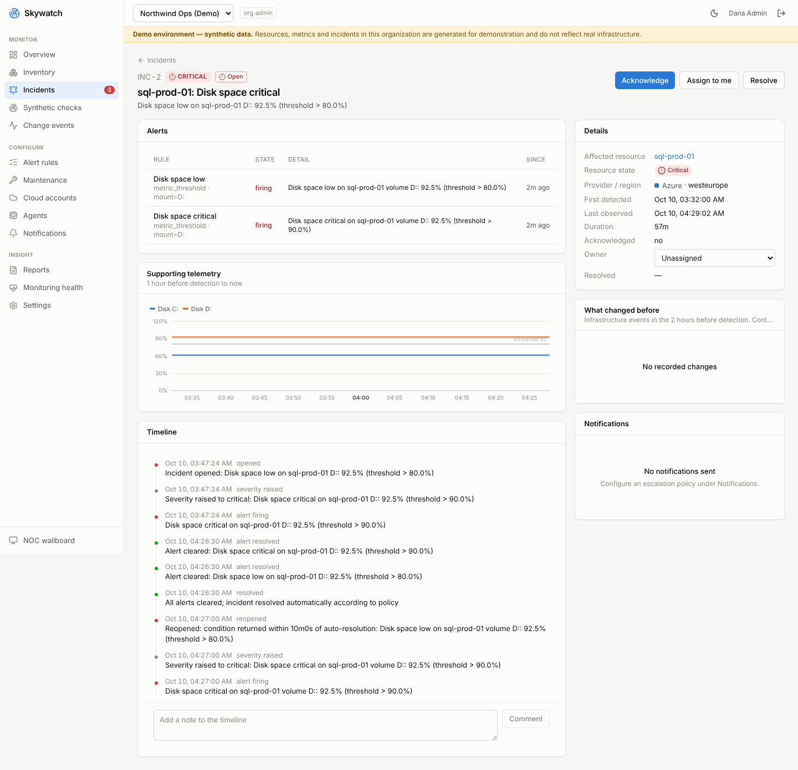

# Skywatch: multi-cloud infrastructure monitoring

Skywatch is a monitoring and observability platform for NOC, SRE and cloud operations
teams. It gives one view of Microsoft Azure, DigitalOcean, Alibaba Cloud and
agent-monitored servers. It answers the operational questions that matter during an
incident:

- What is unhealthy?
- Is the host actually down, or did only the agent stop?
- Which required service stopped?
- Which disk is filling up?
- What changed before this started?


> **Honesty rule.** Skywatch never invents telemetry. When something is unknown, Skywatch says so. A metric a provider cannot supply is shown as *unavailable, with the reason*. A host whose agent is silent is *Critical, host status unconfirmed* until an independent signal confirms the outage. A failing integration shows *Monitoring degraded*. The demo organization is labelled *synthetic data* on every screen.

## What works today

| Area | Status |
|---|---|
| Normalized inventory, health engine, alerting, incidents, notifications | **Implemented**, integration-tested against PostgreSQL |
| Azure adapter (Resource Graph, Monitor metrics, Resource Health, Activity Log, Log Analytics heartbeat) | **Implemented**, mocked contract tests; live verification pending credentials |
| DigitalOcean adapter (Droplets, LBs, DBs, DOKS, Volumes, Monitoring API) | **Implemented**, mocked contract tests; live verification pending credentials |
| Alibaba Cloud adapter (ECS, ECS health, CloudMonitor) | **Implemented** for ECS; RDS/SLB/OSS **not implemented** |
| Go agent (Linux systemd, Windows SCM, per-volume disk, enrollment, rotation) | **Implemented**; Linux verified on a real host; Windows compiles, not run here |
| Synthetic HTTP/TCP/DNS/TLS checks with SSRF protection | **Implemented**; ICMP needs a probe with raw-socket privilege |
| Management API (OIDC, sessions, RBAC, RLS tenant isolation, audit) | **Implemented**, tested |
| Web UI (overview, inventory, server detail, incidents, onboarding wizard, wallboard, reports) | **Implemented**, e2e tested |

The full matrix is in [docs/PROVIDER_CAPABILITIES.md](docs/PROVIDER_CAPABILITIES.md). Acceptance scenario status is in [docs/LIVE_VERIFICATION.md](docs/LIVE_VERIFICATION.md).

## Screenshots

| Overview | NOC wallboard |
|---|---|
|  |  |
| **Server detail** | **Incident** |
|  |  |

These screenshots come from the demo organization: synthetic data, labelled as such in the UI.

## Architecture in one paragraph

A **Go backend** (`go/cmd/skywatch`) is one binary with roles:

- `collector`: durable, lease-based provider polling
- `evaluator`: health state, alert rules and incidents, with leader election
- `ingest`: the agent HTTPS API
- `notifier`, `probe`, `maintenance`

A **TypeScript/Fastify management API** (`apps/api`) serves the UI. It runs as a PostgreSQL role subject to **row-level security**, so tenant isolation is enforced by the database as well as the code. A **Next.js** UI (`apps/web`) talks only to the API. **PostgreSQL** is the single stateful dependency: daily-partitioned raw metrics, hourly rollups and retention jobs. The **Go agent** (`go/cmd/skywatch-agent`) runs on Windows and Linux and connects outbound only.

Details: [docs/ARCHITECTURE.md](docs/ARCHITECTURE.md).

## Quick start (local)

Requirements: Docker with Compose, or Go 1.26, Node 22 and PostgreSQL 16.

```bash
cp deploy/.env.example deploy/.env      # generates nothing secret for you: edit the values
docker compose -f deploy/docker-compose.yml --env-file deploy/.env up --build
# UI: http://localhost:3000  — sign in as admin@demo.local / the SKYWATCH_DEMO_PASSWORD you set
```

The compose stack migrates the database and seeds two organizations:

- **Northwind Ops (Demo)**: synthetic Azure, DigitalOcean and Alibaba accounts with scripted problems (high CPU, a full volume, a stopped service, a silent heartbeat, provider-degraded health).
- **Acme Infrastructure**: empty. Use it to connect real accounts and agents, and to see tenant isolation.

Running without Docker, tests, and the live-verification procedure are covered in [docs/DEVELOPMENT.md](docs/DEVELOPMENT.md).

## Repository layout

```
apps/api/            Management API (Fastify, TypeScript) + vitest suites
apps/web/            Next.js UI + Playwright e2e
go/cmd/skywatch/     Backend binary (collector, evaluator, ingest, notifier, probe, maintenance)
go/cmd/skywatch-agent/  Cross-platform monitoring agent
go/internal/         Providers (azure, digitalocean, alibaba, demo), health, alerting, evaluator, ...
go/pkg/telemetry/    Versioned agent ↔ ingest contract (v1)
db/migrations/       SQL migrations (applied by `skywatch migrate`)
deploy/              docker-compose, Dockerfiles, agent installers, Terraform
docs/                PRD, architecture, state model, security, capability matrix, runbooks, ADRs
```

## Credentials and infrastructure needed for live integration

| Integration | What you must provide |
|---|---|
| Azure | Entra ID app (client secret or certificate) with **Reader** + **Monitoring Reader** on target subscriptions. Optionally **Log Analytics Reader** on the workspace receiving Azure Monitor Agent heartbeats. See [docs/onboarding/azure.md](docs/onboarding/azure.md) |
| DigitalOcean | Personal access token with read-only custom scopes, plus `do-agent` on Droplets for memory and disk ([guide](docs/onboarding/digitalocean.md)) |
| Alibaba Cloud | RAM user AccessKey with the read-only policy in [docs/onboarding/alibaba.md](docs/onboarding/alibaba.md), plus the CloudMonitor agent for guest metrics |
| SSO | An OIDC provider (Entra ID, Okta, Auth0, Keycloak…) client: `SKYWATCH_OIDC_*` |
| Email | SMTP relay: `SKYWATCH_SMTP_*` |
| Production keys | A KMS/Key Vault-backed KEK (see [docs/SECURITY.md](docs/SECURITY.md#key-management)) |
