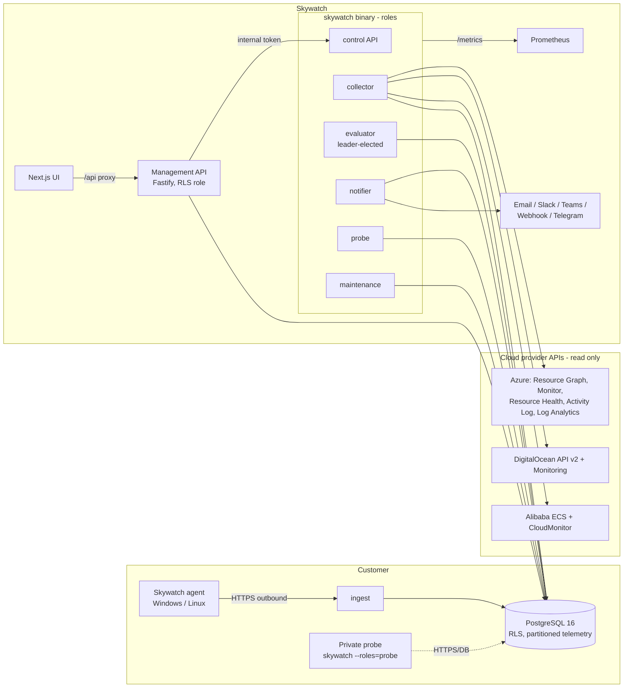
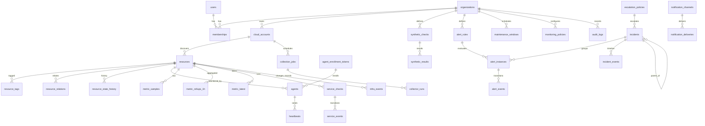

# Architecture

## Goals that shaped it

1. **Correct before clever.** Health decisions are pure functions with table-driven tests (`go/internal/health`, `go/internal/alerting`). Everything else feeds them evidence.
2. **One stateful dependency.** PostgreSQL holds inventory, telemetry, state and queues. Redis, NATS and TimescaleDB are deliberately *not* introduced yet ([ADR-0002](adr/0002-postgres-only.md)). The interfaces where they would slot in are noted below.
3. **Few deployables.** One Go binary with roles, one API, one UI, one agent. Roles scale independently by running the same image with different `SKYWATCH_ROLES`.
4. **Tenant isolation in the database.** The API connects as a role subject to row-level security ([ADR-0003](adr/0003-rls-tenant-isolation.md)).

## Components



| Component | Responsibility | Scaling and HA |
|---|---|---|
| `collector` | Claims due `collection_jobs` (`FOR UPDATE SKIP LOCKED`, leases), runs provider adapters, writes inventory, metrics, health, heartbeats and events | Any number of instances. Jobs are leased, so a crashed instance's work is retaken after the lease expires |
| `ingest` | Agent enrollment, telemetry, rotation, config (`pkg/telemetry` v1) | Stateless, behind a load balancer |
| `evaluator` | Every 30 s: alert rules → instances → incidents → correlation → resource state → escalation | One active leader (PostgreSQL advisory lock); standbys take over automatically |
| `notifier` | Drains the transactional outbox `notification_deliveries` with retries | Any number (`FOR UPDATE SKIP LOCKED`) |
| `probe` | Synthetic checks at a named location; `public` or `private` scope | One per location; private probes bound to one organization |
| `maintenance` | Partitions, rollups and retention | Advisory-locked; safe to run on every instance |
| `control` | Internal API used by the management API for validate/discover/test-send | Private listener, bearer token |
| Management API | AuthN (OIDC, local dev), sessions, CSRF, RBAC, all UI endpoints, reports | Stateless |
| UI | Next.js (client-rendered data, same-origin `/api` proxy) | Stateless |

## Data flow: from signal to incident

```mermaid
sequenceDiagram
  participant P as Provider API / Agent
  participant C as collector / ingest
  participant DB as PostgreSQL
  participant E as evaluator
  participant N as notifier
  P->>C: inventory, metrics, health, heartbeats, events
  C->>DB: upsert resources; idempotent metric insert; metric_latest
  E->>DB: load org state (resources, agents, rules, instances, windows)
  E->>E: EvaluateSeries / Step (pure) per rule × subject × series
  E->>DB: alert_instances + alert_events
  E->>DB: open/attach/reopen/resolve incidents, correlation, timeline
  E->>E: health.Evaluate(signals) per resource
  E->>DB: operational_state + state history + flapping
  E->>DB: notification_deliveries (outbox) per escalation policy
  N->>DB: claim due deliveries
  N-->>N: send with retries; record outcome
```

## Data model



Distinct kinds of data:

| Kind | Tables | Retention |
|---|---|---|
| Raw measurements | `metric_samples` (daily partitions), `heartbeats` (daily partitions), `synthetic_results` | 30 days (partition drop) |
| Aggregated measurements | `metric_rollups_1h` (avg/min/max/count per source) | 12 months |
| Latest values | `metric_latest` | live |
| Calculated health | `resources.operational_state/signals`, `resource_state_history` | history kept by policy |
| Alert and incident events | `alert_instances`, `alert_events`, `incidents`, `incident_events` | alert events 400 days; incidents and audit by policy (no automatic deletion) |

Indexes are tenant-aware (`org_id` leading where the access path is per tenant) or
resource-keyed (`resource_id, metric, series, ts`) where the resource implies the tenant.
The unique key `(resource_id, metric, series, ts, source)` makes ingestion idempotent.

## Provider adapter contract

`go/internal/providers/provider.go`: every adapter implements `Capabilities`,
`MetricSupport`, `ValidateCredentials`, `Discover`, `CollectMetrics` (with explicit
`Unavailable` reasons), `CollectHealth`, `CollectHeartbeats` and `CollectEvents`. It
returns `ErrNotSupported`, `ErrInvalidCreds`, `ErrForbidden` or `ThrottledError` so the
scheduler can tell "the API failed" from "the resource failed". Adding AWS or GCP means
adding a package and registering it in `cmd/skywatch/adapters.go`.

## Scaling notes

| Bottleneck | Today | Next step |
|---|---|---|
| Metric write volume | Batched `unnest` inserts into daily partitions | TimescaleDB hypertables + compression, or Prometheus remote-write to Mimir/VictoriaMetrics behind the same `tsdb` package |
| Azure metrics API calls | One ARM call per resource per interval (bounded concurrency) | Azure Monitor batch metrics API (`metrics.monitor.azure.com`, 50 resources per call) |
| Evaluator cycle | Per-org transaction, every 30 s | Shard orgs across leaders (advisory lock per org hash bucket) |
| Ingest fan-in | Synchronous DB write per batch | Durable queue (NATS JetStream) between ingest and writer when sustained load needs it |

## Self-observability

- Prometheus endpoint (`SKYWATCH_METRICS_ADDR`, default `:9090/metrics`):
  - collector runs, durations, provider calls and throttles
  - ingest outcomes and latency
  - evaluator cycles
  - notification outcomes
  - probe results
  - queue depths
- `platform_instances` heartbeats every 15 s with queue depths and DB latency. Shown on **Monitoring health**.
- If no ingest instance is alive, or every agent goes silent at once, the evaluator sets `IngestDegraded`. Missing heartbeats are then *not* treated as host evidence.
- `collector_runs` keeps per-job history: status, error, API calls and throttled calls.
