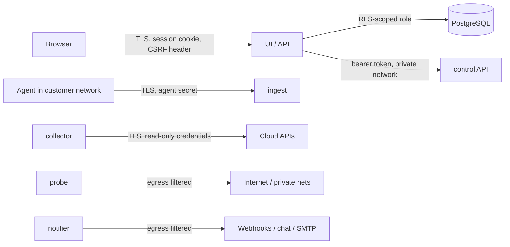

# Security design and threat model

Skywatch holds credentials that can read entire cloud estates and receives data from
hosts inside customer networks. Security is a design input, not a feature. The controls
below are mapped to OWASP ASVS 4.0 and the OWASP API Security Top 10 (2023).

## Trust boundaries

## STRIDE analysis

| Threat | Example | Mitigation |
|---|---|---|
| **Spoofing**: user | Credential stuffing | OIDC SSO with MFA at the IdP; local login disabled in production by default; login rate limit (10/min/IP); scrypt hashes; uniform error messages and timing |
| **Spoofing**: agent | Forged telemetry for another host | Per-agent 256-bit secret (SHA-256 at rest, constant-time compare); single/limited-use expiring enrollment tokens; revocation; one active agent per resource |
| **Tampering**: telemetry | Malformed or oversized batches | 1 MiB body limit, strict JSON (unknown fields rejected), schema validation (names, counts, states), per-agent rate limits, idempotent batch IDs |
| **Tampering**: cross-tenant writes | API bug writes into another org | PostgreSQL RLS `WITH CHECK (org_id = app_org_id())` on every tenant table; `FORCE ROW LEVEL SECURITY` |
| **Repudiation** | "I didn't disable that rule" | Append-only `audit_logs` (API role has no UPDATE/DELETE), actor, IP and details on every mutating endpoint and agent enrollment/rotation |
| **Information disclosure**: credentials | DB dump leaks cloud keys | Envelope encryption (AES-256-GCM, per-secret DEK, KEK from KMS), AAD bound to `org_id:account_id`; secrets never returned by any endpoint; UI clears secret fields after submit |
| **Information disclosure**: cross-tenant reads | IDOR on `/resources/:id` | RLS on every table including `users`/`sessions`; pre-auth lookups only through narrow SECURITY DEFINER functions; tests in `apps/api/test/api.test.ts` |
| **Information disclosure**: SSRF | Synthetic check to `169.254.169.254` | API-side validation, plus **dial-time IP filtering** in Go (`netguard`), which also defeats DNS rebinding; public probes refuse RFC 1918, loopback, link-local, CGNAT and metadata addresses; private probes are org-bound and still refuse metadata endpoints; webhooks must be HTTPS and are checked the same way |
| **DoS** | Agent flood, expensive queries | Rate limits (API 600/min/IP, ingest per agent and per IP), bounded concurrency, query time-range caps (400 days), result limits, provider back-off |
| **Elevation of privilege** | Viewer acknowledges incidents | Server-side RBAC per route (`requirePerm`); roles cumulative and minimal; last-admin protection |
| **Elevation of privilege**: agent as a backdoor | Server pushes commands | The agent has **no command channel**. The server can only change intervals and the watched-service list. Service names are validated and passed to `systemctl` without a shell |

## Controls by area

### Authentication and sessions (ASVS V2, V3)
- OIDC authorization code flow with PKCE, `state` and `nonce` (`openid-client`). Users must be invited (pre-provisioned by email) before their first SSO sign-in. Unverified emails are rejected.
- Opaque random session tokens (256-bit) in `HttpOnly`, `SameSite=Lax`, `Secure` (production) cookies. Only the SHA-256 of the token is stored. Sessions expire after 12 h by default. Disabled users lose access on their next request.
- CSRF: double-submit style. Every state-changing request must echo the session's CSRF token in `X-CSRF-Token`.

### Access control (ASVS V4)
| Role | Read | Incidents | Maintenance | Rules, checks, channels, policy | Accounts, agents | Users, audit |
|---|---|---|---|---|---|---|
| Viewer | ✓ | | | | | |
| Operator | ✓ | ✓ | ✓ | | | |
| Infrastructure admin | ✓ | ✓ | ✓ | ✓ | ✓ | |
| Organization admin | ✓ | ✓ | ✓ | ✓ | ✓ | ✓ |

### Key management
- `SKYWATCH_KEKS="v2:<b64>,v1:<b64>"`: the first key encrypts and all keys decrypt. This supports rotation: add a new key first, re-seal, then retire the old key. This local keyring is for development and single-node installs.
- Production: implement `secrets.KeyProvider` against Azure Key Vault `wrapKey`/`unwrapKey` (or AWS KMS / GCP KMS), so the KEK never leaves the HSM. *Status: interface ready; the Key Vault provider is not implemented.* Terraform provisions the vault and key.
- The Go and TypeScript implementations share one envelope format, verified by a cross-language test vector.

### Cloud credentials
- Least privilege, read-only roles (onboarding guides list exact roles, scopes and RAM actions).
- Validation produces a permission report listing missing permissions, instead of failing opaquely.
- Rotation: `PATCH /accounts/:id` re-seals new credentials and returns the account to *pending* until it validates.

### Supply chain (CI)
- `govulncheck` and `npm audit --omit=dev` gate merges. Dependencies are pinned (go.sum, package-lock).
- Secret scanning (gitleaks) on every push.
- Container images build from distroless or alpine bases and run as non-root.

### Data protection
- TLS everywhere: the agent requires `https` unless explicitly configured for local development, uses TLS 1.2 minimum, and supports a custom CA.
- The agent never reads process command lines, environment variables or file contents.
- CSV exports neutralise spreadsheet formula injection. Notification fields strip CR/LF to prevent header injection.

## Residual risks and follow-ups
- KMS-backed `KeyProvider` (Key Vault) to replace the env keyring in production.
- mTLS for agents (planned as an alternative to bearer secrets).
- Per-tenant rate limiting at the API (today it is per IP).
- Private probe enrollment flow (today private probes are deployed with a worker DB DSN; a pull-based probe API is the planned design).
